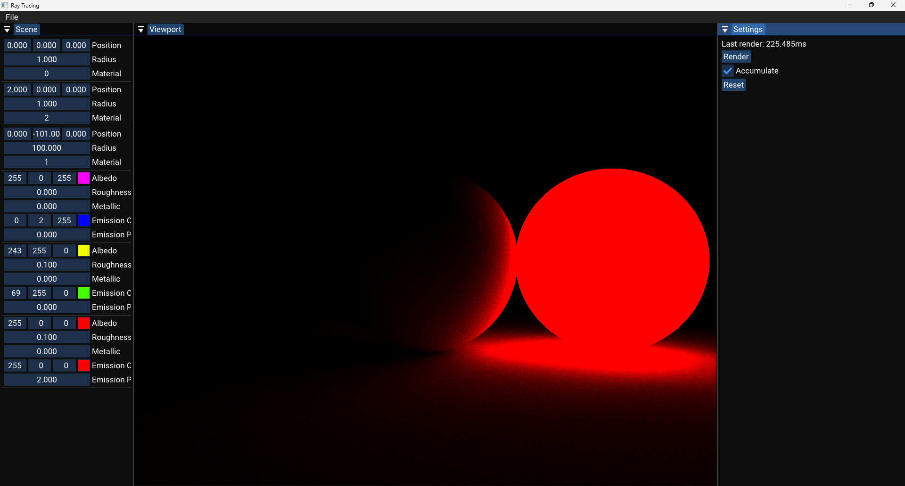
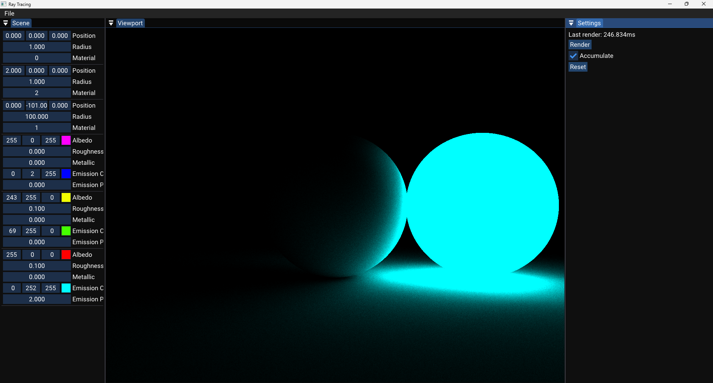

# Vulkan Ray Tracing Renderer

A real-time ray tracing application built using **C++**, **Vulkan**, and **Dear ImGui**. This project demonstrates physically-based lighting, emissive materials, and dynamic scene composition with real-time parameter editing via ImGui.


*Example with cyan emissive lighting*


*Example with red emissive lighting*

## Features

- ⚡ Real-time ray tracing renderer using Vulkan compute shaders
- 🧱 Material system with Albedo, Roughness, Metallic, and Emission properties
- 🎮 Interactive scene editing with Dear ImGui
- 🌈 Color emission and light propagation
- 🔁 Frame accumulation toggle for noise reduction
- 📊 Live performance metrics and render timing

## Controls

- Use the **ImGui interface** to:
  - Add/edit spheres in the scene
  - Modify position, radius, and material index
  - Adjust material properties (color, emission, roughness, metallic)
  - Reset accumulation buffer after changes
- Toggle **accumulation** for better visual quality over time
- 
### Build Steps

```bash
git clone https://github.com/your-username/vulkan-raytracing-app.git
cd vulkan-raytracing-app
mkdir build && cd build
cmake ..
make

